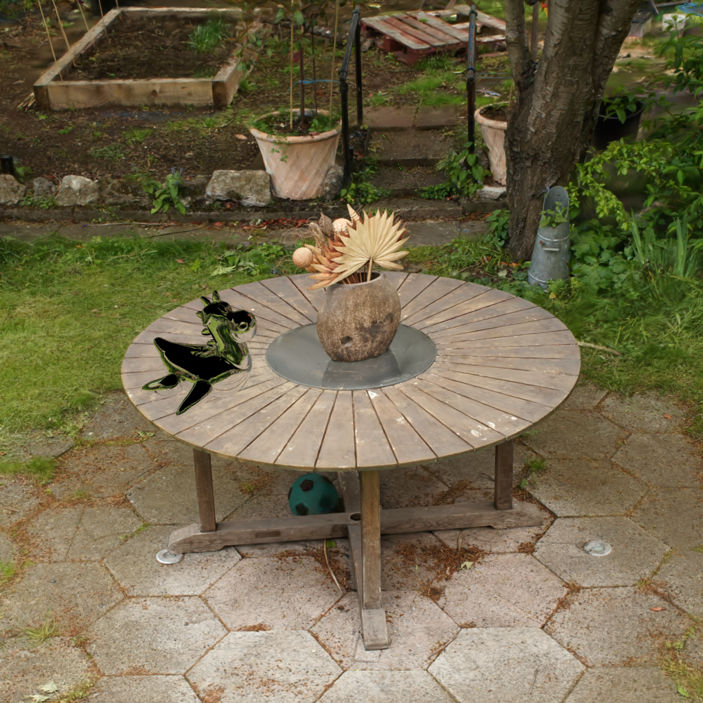

## 2D Gaussian Splat

  
  
   
  Single splat and example scene (render from <a href="https://github.com/pablode/gatling">gatling</a>).

splat2d.mtlx calculates the splat output opacity via the `<splat2d>` node and following inputs:
  * _position_ (vector3): Object space position of the splat.
  * _base_opacity_ (float): Base opacity of the splat.

Creator: [Oliver Markowski](https://www.youtube.com/watch?v=BUpDqXmSWBw) & Pablo Delgado

License: CC0 (Public Domain)

Remarks:
- ported from [Oliver's USD scene](https://www.youtube.com/watch?v=BUpDqXmSWBw) to .mtlx format
